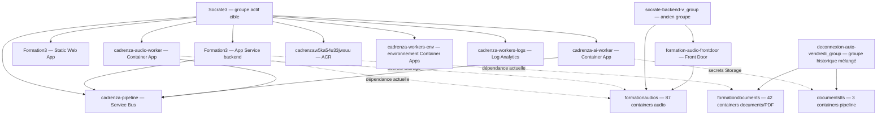
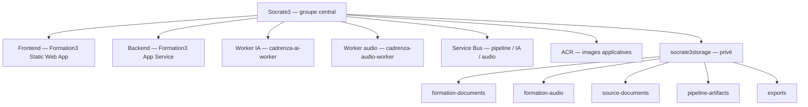

# Cartographie Azure — projet Le Socrate

- Date de l’inventaire : 10 août 2026.
- Méthode : Azure CLI en lecture seule, complétée par les ressources déclarées dans le dépôt.
- Abonnement interrogé : `Azure subscription 1`.
- Aucun déplacement, renommage ou suppression n’a été effectué.
- Inventaire obtenu : 17 groupes de ressources, 12 comptes Storage, 156 containers, 10 Logic Apps, 2 Container Apps, 1 environnement Container Apps, 1 Service Bus et 2 registres ACR.
- Les noms des containers sont visibles, mais le contenu des blobs n’a pas pu être listé avec le rôle Azure actuel : un rôle `Storage Blob Data Reader` sera nécessaire pour cartographier les fichiers et les préfixes internes.

## Vue générale



## Groupes de ressources

| Groupe | Ressources principales observées | Lecture initiale |
| --- | --- | --- |
| `Socrate3` | `Formation3`, frontend `Formation3`, workers IA/audio, Service Bus, ACR, environnement Container Apps, Log Analytics, identités managées, `mails3`, `mailogicapp2` | Groupe actif principal et cible de rationalisation |
| `Socrate2` | `socrate-backend-p2`, frontend `Formation2`, `scheduleHourClass3`, 3 Storage, plan App Service, identités | Encore actif ou à conserver tant que la plateforme 2 existe |
| `socrate1_group` | backend `socrate1`, slot `staging`, identité | À conserver car des formations tournent encore sur Socrate 1 |
| `socrate1_group-a63b` | frontend static `socrate1` | Groupe frontend séparé de Socrate 1 |
| `Socrate4` | backend et frontend `Plateforme4`, identité | Ancienne plateforme à vérifier |
| `socrate-rg` | ancien App Service `socrate`, plan, identité | Ancienne génération du projet |
| `socrate-backend-v_group` | `socrate-backend-v`, `rag`, `formationaudios`, Front Door, identités | Ancien groupe encore critique pour le stockage audio actuel |
| `deconnexion-auto-vendredi_group` | Logic App, plusieurs Storage, `documentstts`, `formationdocuments`, SQL Commerce, Data Factory, Cognitive Services, scrapers, Functions, ACR, logs | Groupe historique très mélangé ; ne pas déplacer sans audit de dépendances |
| `AutomatisationMails` | App Service, Static Web App, SQL, 8 Logic Apps, NLP, identités | Domaine mail indépendant à auditer séparément |
| `BackendBDD_group` | App Service `BackendBDD`, Application Insights, identités | Ancien backend/base de données à qualifier |
| `Émargement_salariés` | App Service, frontend, SQL, logs, identité | Module émargement distinct |
| `Documentation-Hebdomadaire` | App Service, frontend, SQL, Cognitive Services, logs, identité | Module documentation distinct |
| `TTS` | Cognitive Services `ttsazure9999` | Ancien service TTS à comparer avec Fish Audio et les workers actuels |
| `DefaultResourceGroup-PAR` | Workspace Log Analytics par défaut | Ressource Azure générale, pas nécessairement spécifique au projet |
| `rag-pdf-rg` | aucune ressource renvoyée par l’inventaire | Groupe vide apparent, à confirmer |
| `mail4_group` | aucune ressource renvoyée par l’inventaire | Groupe vide apparent, à confirmer |
| `deconnexion-auto-samedi_group` | aucune ressource renvoyée par l’inventaire | Groupe vide apparent, à confirmer |

## Socrate3 — structure actuellement active

- **Application** : `Formation3` sur Azure App Service.
- **Frontend** : Static Web App `Formation3`.
- **Worker IA** : `cadrenza-ai-worker`.
- **Worker audio** : `cadrenza-audio-worker`.
- **File durable** : Service Bus `cadrenza-pipeline-5ka54u33jwsuu`.
- **Files Service Bus** :
  - `formation-pipeline` ;
  - `formation-ai` ;
  - `formation-audio`.
- **Images** : ACR `cadrenzaw5ka54u33jwsuu`.
- **Environnement** : `cadrenza-workers-env`.
- **Logs** : `cadrenza-workers-logs`.
- **Identités** : identité Formation3, identité worker IA et identité worker audio.
- **Base de données Azure** : aucun Azure Database for PostgreSQL détecté dans l’inventaire ; la base semble être fournie par une connexion PostgreSQL/Supabase externe.
- **Dépendances encore externes au groupe** : stockage audio, stockage documents/PDF, stockage pipeline et Front Door.
- **Logic Apps présentes dans Socrate3** : `mails3` et `mailogicapp2`, à qualifier avant décision.

## Comptes Storage et containers

### `formationaudios` — `socrate-backend-v_group`

- 87 containers recensés.
- Accès public Blob actuellement activé.
- Structure historique observée :
  - `audioqapause` ;
  - `audios` et `audios2` ;
  - `formationaudio-dev` ;
  - `formationaudio-p2` à `formationaudio-p41`, avec plusieurs numéros absents ;
  - containers `formationaudio-pX-archives` ;
  - anciens containers `formationaudio-archives`, `formationaudio-archives-p2`, `-p5`, `-p6`, `-p12` ;
  - `pipelinebackup`.
- Lecture initiale : principal stockage audio historique, fortement fragmenté par plateforme et par archive.

### `formationdocuments` — `deconnexion-auto-vendredi_group`

- 42 containers recensés.
- Accès public Blob désactivé.
- Containers généraux :
  - `formation-course-materials` ;
  - `formation-attendance` ;
  - `formationpdf`.
- Containers par plateforme : `formationpdf-p2` à `formationpdf-p41`, avec les mêmes trous de numérotation que le stockage audio.
- Lecture initiale : stockage PDF/supports historique à sortir du groupe mélangé à terme.

### `documentstts` — `deconnexion-auto-vendredi_group`

- 3 containers recensés.
- Accès public Blob désactivé.
- Containers :
  - `documenttts` : documents ou textes sources TTS ;
  - `audiostts` : audios générés ;
  - `pipeline-artifacts` : artefacts JSON, reviews, checkpoints ou diagnostics.
- Lecture initiale : c’est la structure la plus proche de l’architecture pipeline actuelle déclarée dans le dépôt, mais le compte est encore rangé dans un ancien groupe.

### Autres comptes Storage

| Compte | Groupe | Containers | Lecture initiale |
| --- | --- | --- | --- |
| `storageaudits123` | `deconnexion-auto-vendredi_group` | `csv-container`, `csvimport`, `scraping-data-blob` | Audits/scraping, probablement hors cœur formation |
| `storagenotion` | `deconnexion-auto-vendredi_group` | `notion-files` | Transfert Notion, accès public Blob activé |
| `deconnexionautovend815d` | `deconnexion-auto-vendredi_group` | `app-package-*`, `azure-webjobs-hosts`, `azure-webjobs-secrets` | Storage technique Function/App Service |
| `deconnexionautovend9130` | `deconnexion-auto-vendredi_group` | `app-package-*`, `azure-webjobs-hosts`, `azure-webjobs-secrets` | Storage technique Function/App Service |
| `deconnexionautovenda690` | `deconnexion-auto-vendredi_group` | `app-package-*`, `azure-webjobs-hosts`, `azure-webjobs-secrets` | Storage technique Function/App Service |
| `deconnexionautovendac8a` | `deconnexion-auto-vendredi_group` | `azure-webjobs-hosts`, `azure-webjobs-secrets` | Storage technique Function/App Service |
| `socrate2804c` | `Socrate2` | `azure-webjobs-*`, `scm-releases` | Storage technique de déploiement |
| `socrate29ca7` | `Socrate2` | `azure-webjobs-*`, `scm-releases` | Storage technique de déploiement |
| `socrate2a59a` | `Socrate2` | `app-package-*`, `azure-webjobs-*` | Storage technique de déploiement |

## Dépendances applicatives visibles

- Formation3 possède encore des paramètres de connexion distincts pour :
  - `AZURE_TTS_STORAGE_CONNECTION_STRING` ;
  - `AZURE_AUDIO_STORAGE_CONNECTION_STRING` ;
  - `AZURE_STORAGE_CONNECTION_STRING` ;
  - les containers TTS, audio, archives et artefacts.
- Les noms des paramètres confirment que Formation3 et les workers utilisent plusieurs stockages logiques.
- Les valeurs des secrets n’ont pas été lues ; la correspondance exacte entre chaque secret et chaque compte Storage reste donc à confirmer avant migration.
- Les workers IA et audio utilisent les mêmes familles de secrets Storage que Formation3.
- Le Front Door `formation-audio-frontdoor` est encore dans `socrate-backend-v_group` et pointe vers le stockage audio historique.

## Architecture cible centralisée — spécifications

- Utiliser `Socrate3` comme groupe de ressources principal à terme.
- Centraliser dans ce groupe les composants du projet : frontend, backend, workers IA/audio, Service Bus, ACR, logs, identités managées et stockage principal.
- Conserver `Socrate1`, `Socrate2` et les anciens groupes pendant la transition ; ne rien supprimer ni déplacer sans validation préalable.
- Un groupe de ressources contient les ressources Azure ; les containers sont organisés à l’intérieur d’un compte Storage.
- Créer un compte Storage central privé, par exemple `socrate3storage`.
- Ne plus créer un compte ou un container par plateforme, ni utiliser les noms historiques `formationaudios` et `documentstts` pour la nouvelle organisation.
- Utiliser des préfixes virtuels stables avec les identifiants techniques, et non uniquement les noms affichés.



### Containers fonctionnels

- `formation-documents` : supports PDF, documents de cours et documents finaux destinés à une formation.
- `formation-audio` : audios générés pour les séances de formation.
- `source-documents` : documents sources importés avant traitement, séparés des livrables finaux.
- `pipeline-artifacts` : manifestes, JSON structurés, checkpoints, journaux et diagnostics techniques du pipeline.
- `exports` : fichiers exportés pour téléchargement ou transmission, lorsque ces fichiers ne doivent pas rester dans les documents de formation.
- Les données d’émargement et les autres données métier restent séparées si elles ont des exigences de conservation ou d’accès différentes ; elles ne doivent pas être mélangées aux documents et audios.

### Arborescence des documents

```text
formation-documents/
└── centre-<centre_id>/
    └── formation-<formation_id>/
        └── journee-<journee_id>/
            ├── support-formation.pdf
            ├── programme-journee.pdf
            └── documents-complementaires/
```

### Arborescence des audios

```text
formation-audio/
└── centre-<centre_id>/
    └── formation-<formation_id>/
        └── journee-<journee_id>/
            └── session-<session_id>/
                ├── manifest.json
                ├── courses/
                │   ├── cours-01.mp3
                │   └── cours-02.mp3
                ├── qa/
                └── pauses/
```

### Règles d’organisation

- La hiérarchie obligatoire est : `centre_id` → `formation_id` → `journee_id` → `session_id` lorsque la donnée concerne une séance audio.
- Chaque séquence ou séance possède sa propre date et son propre identifiant.
- Une séance audio ne doit jamais être identifiée uniquement par son nom ou son numéro de plateforme.
- Le `manifest.json` décrit la séance, les cours, les pauses, les durées, les statuts de génération et les chemins des fichiers.
- Les cours, pauses, Q/R et contrôles qualité d’une même séance restent regroupés sous le même `session_id`.
- Les fichiers finaux et les documents sources ne doivent pas être mélangés.
- Les anciens fichiers restent dans leur emplacement actuel pendant la transition ; une migration progressive pourra être étudiée après la cartographie des dépendances.
- Les containers principaux sont privés ; l’accès se fait par identité managée ou par SAS à durée limitée et contrôlé.
- L’accès public Blob actuellement observé sur `formationaudios` ne doit pas être reproduit dans la cible.

## Points à vérifier avant tout déplacement

- Lire les valeurs de connexion uniquement dans un cadre sécurisé pour associer chaque secret au bon compte Storage.
- Obtenir un rôle `Storage Blob Data Reader` sur `formationaudios`, `formationdocuments` et `documentstts` pour cartographier les blobs et leurs préfixes réels.
- Vérifier les règles Front Door avant de modifier la visibilité de `formationaudios`.
- Vérifier les Logic Apps `mails3`, `mailogicapp2`, `mail4`, `maillogicapp1`, `mailogicapp3`, `mailPresencePaie*`, `mails2` et `deconnexion-auto-vendredi`.
- Vérifier les connexions des anciennes Functions, App Services et schedulers avant de classer leurs groupes comme legacy.
- Confirmer quels groupes vides peuvent être conservés comme historiques et lesquels sont réellement inutilisés.
- Ne déplacer ou renommer aucune ressource avant d’avoir exporté une cartographie des dépendances et un plan de retour arrière.
