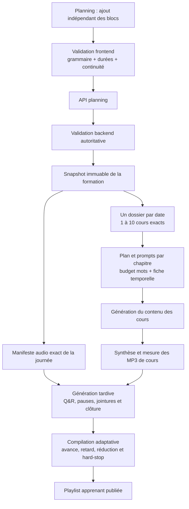
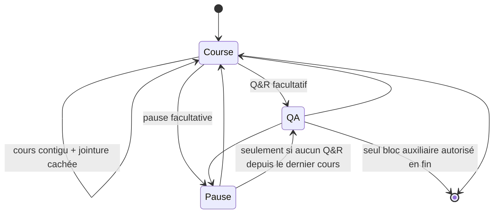

# Spécification vivante — planning pédagogique flexible

Statut : implémenté et couvert par les tests backend/frontend. Ce document est la
référence du chantier. En cas de contradiction, il remplace les anciennes règles
« 7 cours par journée » et les anciennes règles de propriété des intros de breaks.

## Architecture implémentée

## Décisions acquises

### Unité de génération

- Une date sélectionnée dans le planning produit exactement un dossier journée.
- Un dossier journée contient exactement autant de cours générés que de blocs
  `course` placés à cette date : un bloc donne un cours, deux blocs donnent deux
  cours, etc.
- Le pipeline pédagogique n'impose plus sept cours par dossier journée.
- Le nombre de dossiers journée est le nombre de dates contenant au moins un
  cours ; il n'est pas calculé en divisant une durée par sept heures.

### Volume pédagogique

- Le volume total communiqué au prompt initial est la somme des durées
  planifiées de tous les blocs `course` de toutes les dates.
- Pour chaque cours, le budget de texte est calculé depuis sa durée planifiée et
  le débit calibré de la voix en mots par minute.
- Les blocs Q&R et pause ne créent aucun cours, aucune sous-partie pédagogique et
  aucun budget de contenu dans le pipeline de génération des cours.
- Dans le vocabulaire fonctionnel, un bloc `course` correspond à un chapitre
  pédagogique et à une séquence audio de cours.

### Contexte temporel de génération des chapitres

- Le prompt de génération de chaque chapitre doit recevoir un contexte interne
  déterministe construit depuis le planning, afin de ne jamais inventer une
  continuité comme « hier », « ce matin » ou « la semaine dernière ».
- Ce contexte doit rester concis et structuré, sans longue explication répétée
  dans chaque prompt. Il contient seulement : position globale du chapitre,
  position et nombre de chapitres dans la journée, date/heure/durée courantes,
  relation temporelle avec le chapitre précédent et le suivant (même journée ou
  écart en jours), et durée globale de la formation en semaines.
- La fiche doit être injectée sous forme d'un petit objet de données stable ; les
  règles d'interprétation communes restent dans le prompt système partagé.
- Les informations techniques servent à choisir une ouverture cohérente, mais
  ne doivent pas être récitées telles quelles dans le texte entendu.
- Une politique de formulation orale doit distinguer les reprises dans la même
  journée des reprises après une autre date.
- Les introductions peuvent alterner naturellement « aujourd'hui » et « cette
  séance » lorsque ces formulations sont exactes.

### Séparation entre conclusion pédagogique et clôture temporelle

- La conclusion pédagogique intégrée au cours reste durable : elle synthétise le
  chapitre ou la journée sans graver une date de promotion dans le MP3 du cours.
- Une courte clôture temporelle propre à la séance réelle est générée à l'étape
  audio tardive, comme les jointures, Q&R et pauses.
- Si la journée se termine directement par un cours, cette clôture est ajoutée
  après la conclusion pédagogique du cours.
- Si la journée se termine par un Q&R, la projection temporelle est portée par
  l'outro final du Q&R et aucun second closing n'est ajouté.
- La clôture reçoit la prochaine date réelle du planning et peut donc dire
  correctement « demain », « après-demain » ou annoncer une date exacte, sans
  rendre le cours pédagogique durable dépendant d'une promotion.
- La formulation temporelle suit la règle suivante : J+1 « demain », J+2
  « après-demain », puis à partir de J+3 le jour et la date exacts.
- Tout élément de date destiné au TTS est écrit entièrement en lettres, sans
  chiffre ni abréviation, par exemple « lundi quatorze août deux mille
  vingt-six ».
- Si le cours suivant est contigu dans la même journée, il n'y a pas de clôture
  temporelle de journée : la jointure entre cours s'applique.
- S'il n'existe aucune prochaine journée, la clôture termine la formation sans
  annoncer de rendez-vous ultérieur.

### Ouverture et clôture d'une journée à cours unique

- Si la journée contient un seul cours, son introduction est l'unique ouverture
  de la séance et présente directement le thème et ses axes, sans dire « premier
  cours » ni annoncer plusieurs chapitres inexistants.
- Si ce cours est le dernier bloc de la journée, sa conclusion récapitule le
  thème et clôt explicitement toute la séance.
- Si un Q&R suit ce cours unique, la conclusion du cours ferme seulement le
  contenu pédagogique ; l'intro du Q&R annonce les questions et l'outro final du
  Q&R clôt la séance.
- Une pause ne pouvant pas terminer la journée, il n'existe pas de cas valide
  `cours unique → pause → fin`.

### Liberté de composition d'une journée

- Une journée n'a plus de durée minimale d'amplitude imposée.
- Le premier bloc d'une journée est obligatoirement un cours. Un Q&R, une pause
  courte ou une pause déjeuner ne peut jamais précéder le premier cours.
- Une journée peut contenir un seul cours ou plusieurs cours.
- Une journée contient au minimum 1 cours et au maximum 10 cours.
- Les blocs Q&R, pause courte et pause déjeuner sont facultatifs.
- Le planning doit notamment accepter un cours seul, plusieurs cours contigus,
  `course → Q&R`, `course → pause`, `course → Q&R → pause` et
  `course → pause → Q&R`.
- La présence d'un Q&R ou d'une pause ne doit jamais être déduite du nombre de
  cours : seuls les blocs explicitement déposés sont produits.
- Chaque cours individuel reste réglable entre 35 et 90 minutes, comme dans le
  contrat existant.
- Une journée composée d'un seul cours peut donc durer seulement 35 minutes de
  cours, sans minimum d'amplitude journalière supplémentaire.
- La durée d'un cours reste ajustable directement dans le planning.

### Continuité horaire stricte

- Un dossier journée contient une seule chaîne continue de blocs.
- L'utilisateur choisit librement l'heure de début du premier cours, par exemple
  9 h pour une séance du matin ou 14 h pour une séance de l'après-midi.
- Après le premier cours, tous les blocs sont strictement contigus : aucun espace
  vide n'est autorisé entre deux blocs.
- Pour séparer une partie du matin d'une partie de l'après-midi, l'utilisateur
  doit placer explicitement une pause déjeuner dans la chaîne.
- Il est donc interdit de placer un cours à 9 h puis un autre à 14 h sans bloc
  pause couvrant l'intervalle prévu.
- Les blocs ne peuvent pas se chevaucher et la chaîne entière doit rester dans
  les limites de la date.

### Grammaire entre deux cours

- Entre deux cours, ou entre le dernier cours et la fin de journée, on autorise
  au maximum un Q&R et une pause.
- Le Q&R et la pause peuvent apparaître dans l'un ou l'autre ordre :
  `course → Q&R → pause → course` ou
  `course → pause → Q&R → course`.
- `Q&R → Q&R` et `pause → pause` sont toujours interdits.
- Après `course → Q&R → pause`, le bloc suivant est obligatoirement un cours ;
  la pause ne peut pas terminer la journée.
- Après `course → pause → Q&R`, le bloc suivant est un cours ou la fin de
  journée ; le Q&R peut clôturer la journée.
- Une fois un Q&R utilisé depuis le dernier cours, aucun second Q&R n'est permis
  avant le cours suivant. La même règle s'applique à la pause.

### Construction dans l'interface

- L'éditeur expose séparément quatre types de blocs : cours, Q&R, pause courte et
  pause déjeuner.
- L'utilisateur compose sa chaîne bloc par bloc ; aucune séquence
  `course → Q&R → pause` n'est ajoutée automatiquement.
- Après chaque ajout, l'interface évalue la grammaire de la chaîne et active
  uniquement les types de blocs autorisés à la position suivante.
- L'utilisateur ajoute les blocs autorisés à la suite de la chaîne. Il peut
  redimensionner ou supprimer les blocs existants ; les cours ne sont pas
  librement insérables au milieu d'un vide horaire.
- Chaque opération est validée atomiquement sur la chaîne résultante. Si elle
  crée un ordre interdit, un chevauchement, un vide horaire ou une durée hors
  limites, l'interface refuse l'opération et en explique brièvement la raison.
- La suppression d'un cours ne supprime jamais automatiquement ses Q&R ou pauses
  associés.
- Si cette suppression laisserait une chaîne invalide, elle est refusée et un
  message indique que les blocs associés doivent d'abord être retirés ou
  déplacés manuellement.
- Toute modification de la durée d'un bloc recalcule automatiquement les heures
  de début et de fin de tous les blocs suivants, sans changer leur durée.
- Ce reflow conserve une chaîne strictement continue. Si la chaîne recalculée
  dépasserait la fin de la date, la modification est refusée.
- Les choix interdits sont visibles mais désactivés avec une explication courte,
  au lieu d'être acceptés puis rejetés seulement à la validation finale.
- Le backend applique exactement la même grammaire et reste l'autorité finale de
  validation.

### Q&R et pauses

- Les Q&R, pauses courtes et pauses déjeuner restent des blocs facultatifs du
  planning et sont produits uniquement lorsqu'ils y figurent.
- La durée planifiée minimale d'un Q&R ou d'une pause courte est de 10 minutes.
- Leur durée planifiée maximale est de 30 minutes.
- Leur réduction adaptative est limitée à 5 minutes et leur durée effective ne
  descend jamais sous 10 minutes.
- La pause déjeuner est réglable de 60 à 180 minutes.
- Ils sont génériques et indépendants du contenu pédagogique des cours.
- Ils sont générés à l'étape audio, après la génération et la mesure des audios
  de cours, avec leur durée effective définitive.
- Chaque fichier Q&R ou pause possède désormais sa propre intro et sa propre
  outro.
- L'intro d'un Q&R ne doit plus être placée dans l'outro du cours précédent.
- L'intro d'une pause ne doit plus être placée dans l'outro du Q&R précédent.
- Le fichier du bloc flexible démarre immédiatement à la fin réelle du cours ;
  son intro est donc entendue au début réel de ce bloc.
- Si le Q&R est absent et qu'une pause suit directement le cours, la pause
  devient le bloc élastique et hérite des règles du Q&R : elle récupère toute
  avance, peut être raccourcie de 5 minutes maximum, puis le dernier cours est
  coupé si le retard restant dépasse cette marge.
- Dans `course → Q&R → pause`, le Q&R est élastique et la pause conserve sa durée
  planifiée. Dans `course → pause → Q&R`, la pause est élastique et le Q&R
  conserve sa durée planifiée.

### Matrice des intros et outros des blocs auxiliaires

- Chaque Q&R ou pause contient une intro au début de son propre fichier, puis le
  silence utile, puis son outro à la fin de son propre fichier.
- Deux blocs auxiliaires successifs ne doivent pas se réannoncer deux fois :
  l'outro du premier clôt seulement le bloc courant ; l'intro du second annonce
  le nouveau bloc.
- Si un cours suit le bloc auxiliaire, son outro annonce explicitement la
  reprise du cours.
- Les textes restent génériques et ne citent ni thème, ni horaire, ni durée.
- Les textes restent classiques et strictement fonctionnels : aucune remarque
  sur le repas pris, l'appétit, un encas, une boisson, le repos supposé ou le
  ressenti des apprenants.
- Une journée peut se terminer directement après un cours ou après un Q&R, mais
  jamais après une pause courte ou une pause déjeuner.
- Un Q&R final utilise un outro spécifique qui clôt toute la séance de la
  journée au lieu d'annoncer une reprise.

#### Q&R après un cours

- Intro : « Nous allons maintenant prendre un temps pour vos questions sur ce
  que nous venons de voir. Vous pouvez les poser dans le chat. »
- Outro si une pause suit : « Ce temps de questions est maintenant terminé. »
- Outro si un cours suit : « Ce temps de questions est maintenant terminé. Nous
  reprenons le cours. »
- Outro si la journée se termine : « Ce temps de questions est maintenant
  terminé. Cette séance de formation s'achève ici. »

#### Q&R après une pause

- Intro : « Avant de poursuivre, nous allons prendre un temps pour vos
  questions. Vous pouvez les poser dans le chat. »
- Outro si un cours suit : « Ce temps de questions est maintenant terminé. Nous
  reprenons le cours. »
- Outro si la journée se termine : « Ce temps de questions est maintenant
  terminé. Cette séance de formation s'achève ici. »

#### Pause courte après un cours

- Intro : « Nous marquons maintenant une courte pause. »
- Outro si un Q&R suit : « La pause est maintenant terminée. »
- Outro si un cours suit : « La pause est maintenant terminée. Nous reprenons le
  cours. »

#### Pause courte après un Q&R

- Intro : « Nous marquons maintenant une courte pause. »
- Outro si un cours suit : « La pause est maintenant terminée. Nous reprenons le
  cours. »

#### Pause déjeuner

- Intro : « Nous allons maintenant faire une pause déjeuner. »
- L'outro applique la même disjonction que la pause courte : clôture seule si un
  Q&R suit ; annonce de la reprise si un cours suit.
- Les formulations finales seront traitées comme des variantes génériques
  contrôlées afin d'éviter une répétition mécanique d'une journée à l'autre.

### Jointure entre deux cours contigus

- Lorsque deux blocs `course` sont directement contigus dans le planning, le
  système insère automatiquement un audio technique de jointure entre leurs
  deux MP3.
- Cette jointure n'est ni un bloc éditable ni un bloc visible dans le planning
  du centre de formation.
- Elle ne crée aucun cours et aucune sous-partie pédagogique.
- Elle est générique : elle clôt sobrement la partie terminée et annonce la
  poursuite avec un nouveau volet, sans inventer le thème des cours.
- Sa durée réelle est volontairement plafonnée à environ 10 secondes.
- Elle est générée à l'étape audio, après les audios de cours, dans la même phase
  tardive que les Q&R et les pauses.
- Si le premier cours finit en avance, la jointure démarre dès sa fin audio
  réelle, puis le cours suivant démarre immédiatement à la fin de la jointure.
- Toute la chaîne `jointure → cours suivant` est ainsi avancée. La durée de la
  jointure consomme seulement une partie de l'avance récupérée ; elle n'attend
  jamais l'horaire théorique de fin du premier cours.
- Si le premier cours finit exactement à l'heure planifiée, la durée de la
  jointure crée un petit retard cumulé. Ce retard est propagé, compensé ou
  absorbé selon les mêmes règles récurrentes que les écarts des cours.
- Exemple : premier cours prévu jusqu'à 10 h mais terminé à 9 h 52, jointure de
  8 secondes : jointure à 9 h 52, puis cours suivant à 9 h 52 min 8 s.
- Les conclusions de cours doivent fermer le sujet traité sans annoncer à tort
  un Q&R ou une pause. Les débuts de cours doivent entrer dans le nouveau sujet
  sans refaire une ouverture générale de journée.

### Adaptation aux durées audio réelles

- Le cours conserve la durée naturelle de son audio, sous réserve de la limite
  de sécurité déjà prévue pour protéger la durée minimale du bloc flexible.
- Le bloc flexible situé immédiatement après le cours absorbe l'écart entre la
  durée planifiée et la durée réelle du cours.
- Si le cours finit en avance, le bloc flexible commence immédiatement et
  récupère le temps libéré.
- Si le cours dépasse, le bloc flexible commence à la fin réelle du cours et est
  raccourci, sans descendre sous sa durée minimale protégée.
- Dans `course → Q&R → pause`, seul le Q&R est élastique ; la pause conserve sa
  durée planifiée.
- Si le cours dépasse au point de menacer le Q&R, la lecture du cours est coupée
  à la dernière seconde permettant de limiter la réduction du Q&R à
  **5 minutes maximum**.
- Le MP3 complet du cours et son texte source ne sont pas modifiés : seule sa
  lecture effective est arrêtée à cette limite de sécurité.
- Formellement, pour `course → Q&R → pause`, la limite de lecture du cours vaut
  `durée planifiée du cours + 5 minutes`; la pause reste hors de cette première
  marge et conserve sa durée, sauf règle de rattrapage cumulatif explicitement
  prévue plus bas.
- Exemple : cours 60 min, Q&R 15 min, pause 10 min. Le cours peut jouer au plus
  65 min avant la coupure liée au Q&R ; le Q&R dure alors 10 min.
- Exemple cumulatif : Q&R prévu 15 min et retard cumulé 8 min. Le Q&R est ramené
  à 10 min et les 3 min restantes sont coupées sur le dernier cours qui précède
  le Q&R.

### Propagation récurrente entre plusieurs cours

- Une jointure technique fait partie de la chaîne de diffusion, mais ne remet
  jamais l'horloge à l'horaire théorique du planning.
- Dans une suite de cours contigus, l'avance ou le retard effectif est propagé
  de proche en proche : `course[n] → jointure → course[n+1]`.
- Un cours plus court peut compenser tout ou partie du retard cumulé par les
  cours précédents ; un cours plus long augmente ce retard cumulé.
- Tant qu'aucun bloc flexible n'est rencontré, les cours ne sont pas coupés pour
  préserver leur horaire théorique : ils commencent à la fin réelle de la
  jointure précédente.
- Si la chaîne de cours termine la journée sans Q&R ni pause, le dernier cours
  se termine naturellement, même si la fin de journée est en retard.
- Lorsqu'un bloc flexible est rencontré, il absorbe le retard cumulé dans la
  limite de sa marge autorisée.
- Si cette marge ne suffit pas, la coupure de sécurité porte sur le dernier
  cours précédant le bloc flexible, afin de préserver la durée protégée du bloc.
- Une pause déjeuner peut contribuer au rattrapage, mais sa réduction ne peut
  pas dépasser 5 minutes.
- Un Q&R peut contribuer au rattrapage, mais sa réduction ne peut pas dépasser
  5 minutes, quelle que soit sa durée planifiée.
