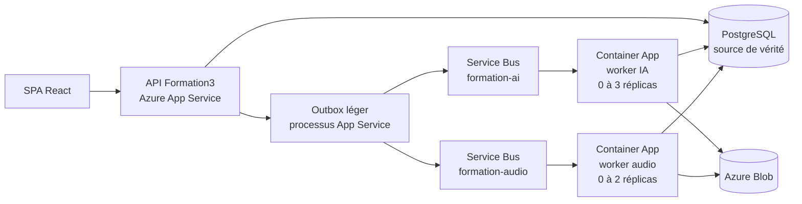

# Workers IA et audio isolés sur Azure Container Apps

## Décision appliquée

La cible de production comporte désormais deux processus et deux services
indépendants :

- `python -m workers.ai_worker` traite `auto_pilot_tick` et
  `ai_teacher_fulfillment` ;
- `python -m workers.audio_worker` traite `hr_playlist_generate` et
  `hr_playlist_item`.

Chaque processus est déployé dans sa propre Azure Container App. Une panne,
un dépassement mémoire ou une mise à l'échelle du worker audio ne redémarre
donc ni le worker IA ni l'API.



Service Bus transporte uniquement l'identifiant du travail. PostgreSQL
conserve le payload, le statut, les tentatives, la lease et le jeton de
fencing. Deux notifications identiques ne peuvent donc pas exécuter deux fois
le même work-item.

## Pourquoi le pont outbox reste dans l'App Service

Les Container Apps utilisent `minReplicas: 0`. Quand les deux sont endormies,
il faut tout de même qu'un processus publie la notification qui les réveille.
Le processus `workers.pipeline_outbox_worker` effectue seulement ce travail
léger dans l'App Service existant :

1. l'API ou le scheduler écrit le work-item et son outbox dans la même
   transaction PostgreSQL ;
2. l'outbox publie vers la file IA ou audio ;
3. KEDA démarre le bon Container App ;
4. le worker claim le work-item dans PostgreSQL avant le traitement coûteux.

Le pont renotifie aussi une tâche DB encore en attente après dix minutes. Cela
répare les tâches créées avant le cutover et une éventuelle notification
perdue. Le fencing PostgreSQL rend ces notifications répétées sans danger.

## Ressources créées

Les modèles Bicep dans `infra/azure` créent :

- un Azure Container Registry Basic privé ;
- un environnement Azure Container Apps Consumption ;
- un espace Log Analytics avec 30 jours de rétention ;
- un namespace Azure Service Bus Standard et trois files ;
- deux identités managées dédiées ;
- les rôles `AcrPull`, `Azure Service Bus Data Sender` et les droits Receiver
  limités à la file de chaque worker ;
- les deux Container Apps sans ingress public.

Les secrets sont repris des App Settings de `Formation3` et transmis à Bicep
comme `secureObject`. Ils ne sont ni inscrits dans Git ni affichés dans les
logs du workflow.

## Déploiement

Le workflow manuel `.github/workflows/deploy_pipeline_workers.yml` :

1. active l'identité managée de `Formation3` ;
2. déploie Service Bus, ACR, les identités et les rôles ;
3. construit l'image avec `backend/Dockerfile.worker` dans ACR ;
4. déploie et vérifie les deux Container Apps ;
5. avec `cutover=true`, désactive l'ancien worker lourd de l'App Service et
   active Service Bus ainsi que le pont outbox ;
6. attend que `/readyz` réponde après le redémarrage.

Le principal OIDC utilisé par GitHub Actions doit avoir `Contributor` ainsi que
le droit de créer des affectations de rôle (`User Access Administrator` ou
`Owner`) dans le resource group. Les App Settings `DATABASE_URL`,
`DEEPSEEK_API_KEY`, `FISH_AUDIO_API_KEY` et les trois connexions Azure Storage
doivent déjà être présents sur `Formation3`.

Les déploiements futurs du workflow API conservent automatiquement la
topologie séparée dès qu'ils trouvent `AZURE_SERVICE_BUS_NAMESPACE` dans les
App Settings. Ils ne réactivent donc pas l'ancien worker par accident.

## Coût estimé en France Central

Estimation au 29 juillet 2026, hors TVA, crédits et remises contractuelles.
Les deux apps ont chacune 1 vCPU et 2 Gio, mais ne sont facturées en calcul que
pendant leur activité grâce au scale-to-zero.

| Poste | Estimation |
|---|---:|
| Service Bus Standard | 8,78 €/mois |
| Container Registry Basic | 0,1462 €/jour, soit environ 4,45 €/mois |
| Stockage ACR | 0,0878 €/Gio/mois |
| Container Apps 1 vCPU + 2 Gio | environ 0,095 € par heure active cumulée |
| Log Analytics | variable selon le volume de logs |

Azure inclut chaque mois, au niveau de l'abonnement, 180 000 vCPU-secondes et
360 000 Gio-secondes pour le plan Consumption. Avec la taille choisie, cela
représente environ **50 heures actives cumulées** si ce quota n'est pas déjà
consommé par d'autres Container Apps.

| Activité cumulée IA + audio + réplicas | Total mensuel approximatif |
|---|---:|
| jusqu'à 50 h | 13 à 18 € |
| 100 h | environ 18 € + logs |
| 200 h | environ 27,50 € + logs |
| deux workers actifs 24 h/24 | environ 147 € + logs |

Une heure avec deux réplicas compte comme deux heures actives. Ces montants
n'incluent pas l'App Service, PostgreSQL et Blob déjà existants, ni la
consommation DeepSeek/Fish Audio.

Sources officielles :
[tarifs Container Apps](https://azure.microsoft.com/pricing/details/container-apps/),
[mise à l'échelle Container Apps](https://learn.microsoft.com/azure/container-apps/scale-app),
[tarifs ACR](https://learn.microsoft.com/azure/container-registry/container-registry-skus),
[tarifs Service Bus](https://azure.microsoft.com/pricing/details/service-bus/),
[identités managées Container Apps](https://learn.microsoft.com/azure/container-apps/managed-identity).

## Retour arrière

Le rollback ne supprime aucune donnée. Il suffit de remettre sur App Service :

```dotenv
PIPELINE_QUEUE_BACKEND=database
PIPELINE_DEDICATED_WORKER=1
PIPELINE_OUTBOX_DISPATCHER=0
```

Après redémarrage, le worker général reprend les tâches non terminales depuis
PostgreSQL. Le workflow API respecte ce choix explicite et ne rebascule pas
vers Service Bus. Les ressources Container Apps et Service Bus peuvent rester
en place pendant le diagnostic.
